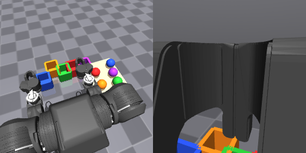
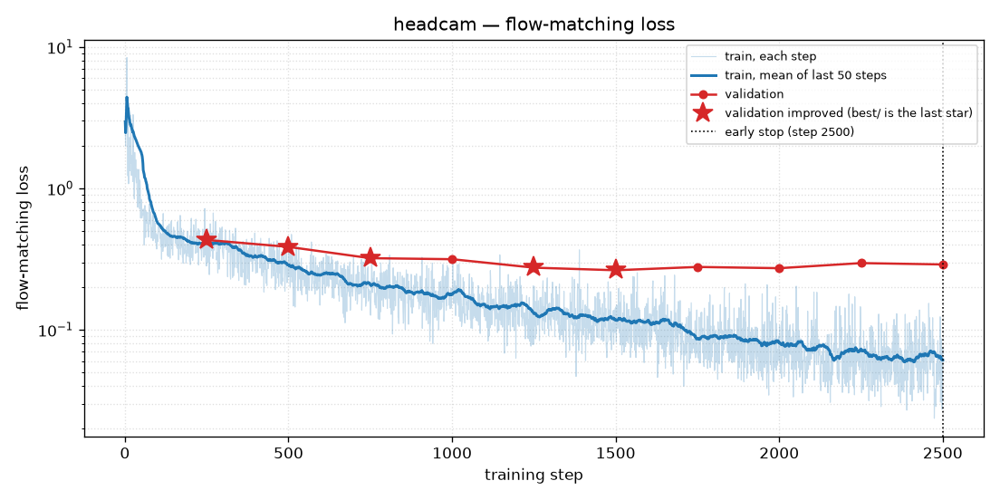
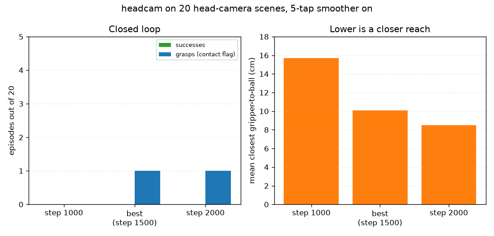

# headcam

Same frozen SmolVLA recipe as Stage A, with the front camera moved to the shoulder and a new set of demonstrations. The question was whether a view that can see the table, the balls, and the bins would grasp on scenes the policy had not trained on.

It reached closer as training went on, and it still did not throw.

## Recipe

`headcam` was added above the shoulders. The observation key stayed `image_front`. Wrist camera unchanged. New data: `data/datasets/train_head` (50 episodes) and `data/datasets/val_head` (20 episodes). No shared seeds with the training set. Vision and language stayed frozen. Batch 8, learning rate 1e-4, warmup 300, schedule written for 4000 steps. Early stop at step 2500. `best/` is step 1500.

The picture the policy sees at reset:

Left is the shoulder view: both arms, the ball table, and the bins. Right is the wrist camera, which at rest is mostly the gripper, with the bins along the bottom edge.

Closed-loop numbers below used a 5-tap moving average on the predicted joint targets (`--smooth 5`). That filter is an eval-time change. On the Stage A checkpoint it created grasps the unsmoothed policy did not make. See [probes](../probes/REPORT.md). These head-camera counts are the filtered ones.

## The loss

Plotted from `checkpoints/headcam/train_log.csv` and `val_log.csv`.

Same shape as Stage A. Training loss falls through the run (raw loss on the last step is 0.074). Validation falls until step 1500 (0.263) and then sits higher: 0.278, 0.272, 0.296, 0.289. The last star is step 1500. The dotted line is the stop at step 2500.

0.263 and Stage A's 0.222 are different images and different episodes. They are not a comparison.

## The robot

Twenty `val_head` scenes, smoother on. Zero balls in the target bin.

| Checkpoint | In the bin | Grasps | Closest |
|---|---|---|---|
| step 1000 | 0/20 | 0 | 15.7 cm |
| `best/` step 1500 | 0/20 | 1 | 10.1 cm |
| step 2000 | 0/20 | 1 | 8.5 cm |

The step-1500 grasp was a green ball aimed at the red bin, closest approach 2.4 cm, then a miss. The step-2000 grasp was a blue ball aimed at the blue bin, 0.6 cm, then a miss. The average closest distance came down across checkpoints. The grasp count stayed at one episode, and the throw never landed.

Nine episodes on `best/` only, on color pairs held out of the training data (red/blue, green/orange, purple/red), three repeats each: 0 grasps, closest 8.2 cm. One episode was labeled wrong-bucket because the ball ended in another bin. The contact flag was false and the closest approach was 9.0 cm. Nine episodes is a spot check, and a never-seen pair was not grasped.

## Videos

- `videos/step1000_never_grasped_purple-into-purple.mp4` — step 1000. All 20 episodes at this checkpoint failed to grasp. Mean closest approach 15.7 cm.
- `videos/best_step1500_grasped_then_missed_green-into-red.mp4` — the best-loss checkpoint. The one grasp, then a miss.
- `videos/step2000_grasped_then_missed_blue-into-blue.mp4` — step 2000. The hand gets to 0.6 cm and the ball still misses the bin.

## Why this happened

The shoulder view does show the table. Closest distance moved from 15.7 cm to 8.5 cm, so the arm's reach changed with the new pixels and the new demos. It stopped at the same place as Stage A: one grasp in twenty, and that grasp does not land.

A frozen SigLIP tower was pretrained on internet images, not on this simulator. Moving the camera changes the picture. It does not train the tower to report where the ball is. The probe on these exact frozen weights, in [probes](../probes/REPORT.md), found that a readout from the image tokens predicts the ball's position no better than ignoring the image. The loss curve here is the action head fitting the reach anyway: training loss keeps falling after validation has bottomed out.

Sources: `checkpoints/headcam/val_log.csv`, `checkpoints/headcam/early_stop.txt`, `artifacts/overnight/headcam/*/eval_summary.json`.
