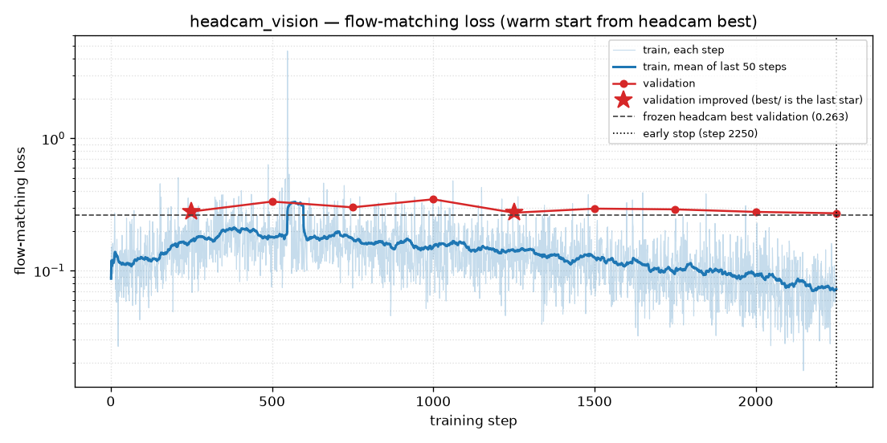

# headcam_vision

The frozen head-camera run was continued with the SigLIP vision tower unfrozen. The language model stayed frozen. Validation loss never beat the frozen checkpoint. The robot was never rolled out, so this folder has no videos.

## Recipe

Started from `checkpoints/headcam/best` (step 1500 of the frozen run), not from the base model. Same 50 training episodes and 20 validation episodes, shoulder camera. `train_expert_only` stayed true, which freezes the language model. The vision tower was trained (`freeze_vision_encoder` false). Batch 4. Batch 8 does not fit in 6 GB once vision gradients are on. Learning rate 1e-4, warmup 300, schedule written for 4000 steps. Early stop at step 2250. `best/` is step 1250.

## The loss

Plotted from `checkpoints/headcam_vision/train_log.csv` and `val_log.csv`.

The curve starts near 0.09 instead of near 3, because the action head was already trained. The dashed line is the frozen run's best validation loss, 0.263. Every validation point on this run is above that line.

Validation bounced between 0.27 and 0.35:

| Step | Val loss | Counted as an improvement |
|---|---|---|
| 250 | 0.280 | yes |
| 500 | 0.333 | no |
| 750 | 0.301 | no |
| 1000 | 0.347 | no |
| 1250 | 0.274 | yes, and this is `best/` |
| 1500 | 0.294 | no |
| 1750 | 0.291 | no |
| 2000 | 0.278 | no |
| 2250 | 0.272 | no |

The stop requires a 2% improvement. 0.272 is not 2% under 0.274, so training ended at step 2250. Raw training loss on that step was 0.092. Training loss and validation loss never met. The action head still fit the 50 demos. The 20 held-out episodes did not get a better match than the frozen tower already had.

There is a tall training-loss spike near step 600. It is one noisy step in the log, and the smoothed curve absorbs it. It is not a second run.

## The robot

No closed-loop eval was run. There is no `eval_summary.json` and there are no videos. A grasp rate for these weights does not exist.

## Why this happened

Fifty demonstrations are a small set for a vision transformer. Unfreezing SigLIP lets gradients move features the action head had already adapted to, on a batch of 4, which makes the validation curve jumpier than the frozen run. The best this achieved (0.274) is still worse than leaving the tower alone (0.263).

The frozen-token probe said those features do not contain the ball's position. This run was the attempt to teach them. On the only measurement that was taken, held-out action loss, it did not. Whether the live arm would have grasped is unmeasured. Given that the frozen head-camera policy grasped once in twenty, a later rollout of a worse validation loss would have needed a large change to mean anything, and that rollout was never done.

Sources: `checkpoints/headcam_vision/val_log.csv`, `checkpoints/headcam_vision/early_stop.txt`, `checkpoints/headcam_vision/checkpoints/002000/pretrained_model/train_config.json`.
