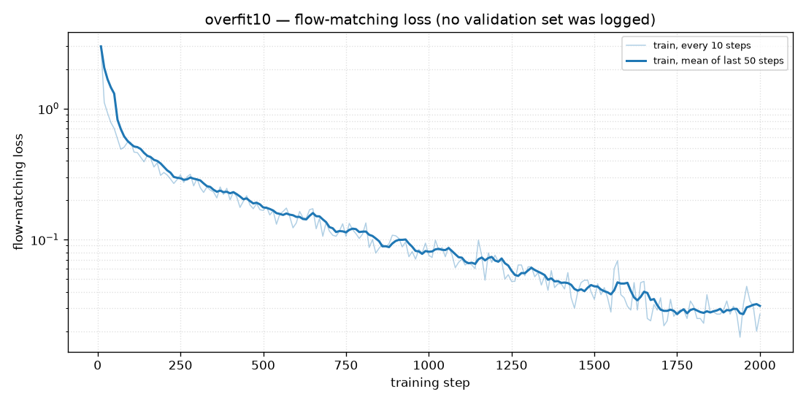

# overfit10

Ten expert throws, room camera, 2000 steps. This is the basic fine-tune. It is also the closest the gripper came to the ball on the 20-scene test used again in Stage A.

## Recipe

Started from `lerobot/smolvla_base`. Dataset `data/datasets/overfit10`: 10 episodes, 2224 frames at 50 Hz. The vision tower and the language model stayed frozen (`freeze_vision_encoder` and `train_expert_only` both true). Only the action expert trained. Batch 8, learning rate 1e-4, warmup 100 steps, decay over 2000. One checkpoint, saved at step 2000. No validation loss was logged. Wall clock was about 80 minutes.

The front image in these videos is the room camera. The simulator's front camera was later moved to the shoulder. These clips are the original eval.

## The loss

The curve is plotted from `artifacts/overfit10_train.log` (every 10 steps; the logger prints `1K` for every step in the thousands, so the step axis is rebuilt as 10, 20, … 2000).

Loss starts at 2.98 on step 10 and is 0.027 at step 2000. About 7 epochs over the 10 episodes. The action head learned the shape of these demonstrations. There is no held-out loss on this plot, so the curve cannot say whether that learning survives a new scene.

## The robot

Only step 2000 exists. Two scene sets:

| Scenes | In the bin | Grasps | Closest |
|---|---|---|---|
| 10 training scenes | 0/10 | 1, then missed the bin | not recorded in that file |
| 20 unseen scenes from `val30` | 0/20 | 3, all then missed the bin | 5.8 cm |

The three grasps on the unseen scenes came within about a centimeter. The other 17 stayed well off the ball, and 5.8 cm is the average of all 20. Nothing landed in the target bin.

## Videos

All of these are the step-2000 checkpoint.

- `videos/step2000_val_grasped_then_missed_orange-into-purple.mp4` — one of the three grasps on an unseen scene. The ball is picked up and misses the bin.
- `videos/step2000_val_never_grasped_blue-into-orange.mp4` — a typical miss on the same 20 scenes. The hand never makes contact.
- `videos/step2000_train_scenes_grasped_then_missed.mp4` — the only grasp on the 10 training scenes (orange ball, purple bin). The policy does not cleanly replay even the episodes it trained on.

## Why this happened

The loss drop is real: ten demonstrations are enough for the action expert to imitate the reach. The grasp is a few centimeters at the end of a ~200-step motion, and the flow-matching loss is dominated by the rest of that motion, so a hand that follows the demo and still misses the ball can have a small loss.

The image encoder was not trained on this simulator. With it frozen, the action head has the joints and a fixed embedding. That is enough to copy a typical reach from ten throws. It is a weak signal for which ball moved this episode. The throws that do pick the ball up still miss the bin, which fits a policy that learned the fling more tightly than the release toward a particular bucket.

Sources: `artifacts/overfit10/eval_summary.json`, `artifacts/baseline_overfit10_val20/eval_summary.json`, `checkpoints/overfit10/checkpoints/002000/pretrained_model/train_config.json`.
