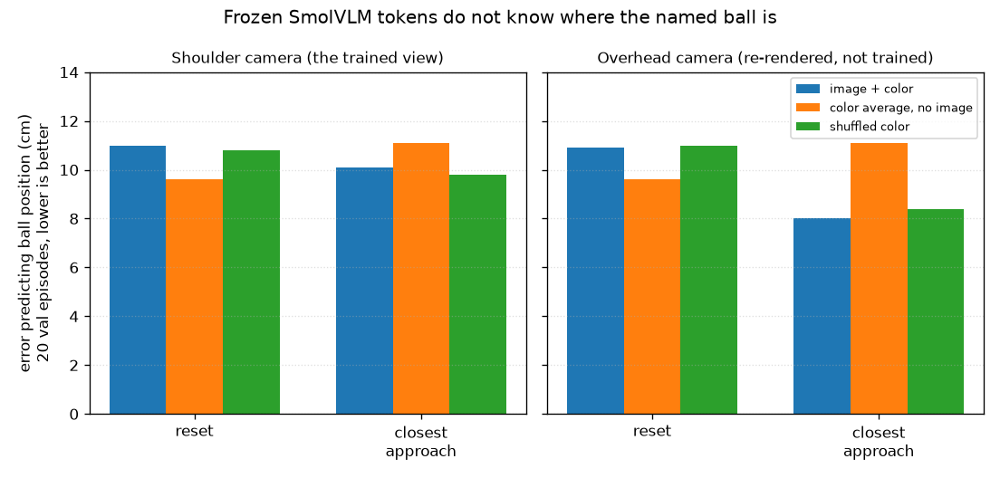

# Probes

Three measurements on checkpoints that already existed. No new fine-tune. Together they are why the later training runs look the way they do.

## The sentence does not select the ball

Stage A `best/`, room camera, first 5 of the 20 validation scenes. Each seed was reset twice: the stored instruction, then the same sentence with a different ball color. The question was whether the closest ball became the new color.

It did 0 times out of 5. On one seed the closest ball changed from blue to purple, and the swapped color was blue, so the arm moved and still did not follow the edit.

Source: `artifacts/overnight/text_swap.json`.

## A smoother creates grasps and does not create throws

Same Stage A weights, same 20 scenes. Unsmoothed, versus a 5-tap moving average along the predicted chunk, per joint.

| | In the bin | Grasps | Closest |
|---|---|---|---|
| Unsmoothed | 0/20 | 0 | 9.6 cm |
| 5-tap average | 0/20 | 2 | 7.3 cm |

Both grasps missed the bin. This is an eval filter, not training. It was left on for every head-camera video in [headcam](../headcam/REPORT.md) because it changed the grasp count.

The unsmoothed column is a second rollout of the same weights that, in the Stage A folder, scored 1 ball in the bin, 1 grasp, and 8.4 cm. Same checkpoint, different noise. One grasp on 20 episodes is inside that noise.

The two videos are the same scene (green ball, red bin), seed for episode 007.

- `videos/smooth_off_green-into-red.mp4` — no contact.
- `videos/smooth_on_green-into-red.mp4` — the filter turns that episode into a grasp, then a miss.

## Frozen vision cannot find the ball

No training step. Image tokens from the frozen head-camera checkpoint, plus a one-hot of the named color, fit with a small readout on the 50 training episodes and scored on the 20 validation episodes. The target is the named ball's position on the table.

Shoulder camera, the view the policy was trained on:

| Frame | Image + color | Average position of that color, no image | Shuffled color |
|---|---|---|---|
| Reset | 11.0 cm | 9.6 cm | 10.8 cm |
| Closest approach | 10.1 cm | 11.1 cm | 9.8 cm |

The readout that sees the image ties the one that ignores it. The saved verdict is **blind**.

An overhead camera, re-rendered from the same seeds, was scored the same way. The stored training videos are still the shoulder view. This overhead number is only the probe.

| Frame | Image + color | Shuffled color |
|---|---|---|
| Reset | 10.9 cm | 11.0 cm |
| Closest approach | 8.0 cm | 8.4 cm |

Blind again. The orange bars match the shoulder chart because that baseline does not use pixels.

Sources: `artifacts/overnight/vision_probe.json`, `artifacts/overnight/vision_probe_overhead.json`.

## What the three probes say about the fine-tunes

The action expert is imitating a reach from the joints and from a frozen embedding that does not contain the ball. That is consistent with every training curve in this folder:

- Overfit10 can drive the loss from about 3 to about 0.03 and still average 5.8 cm from the ball.
- Stage A, given 50 demos of the same features, memorizes the reach (training loss down, validation loss up after step 2000) and finishes farther from the ball than the 10-demo run.
- The shoulder camera changes the picture and the closest distance, and the frozen tokens from that camera still cannot point at the ball. One grasp in twenty, nothing in the bin.
- Unfreezing SigLIP for 2250 steps on those 50 demos never beat the frozen validation loss, and the arm was not re-tested.

The text swap puts the language model in the same place as the vision tower. The color in the sentence is not what the hand follows.
