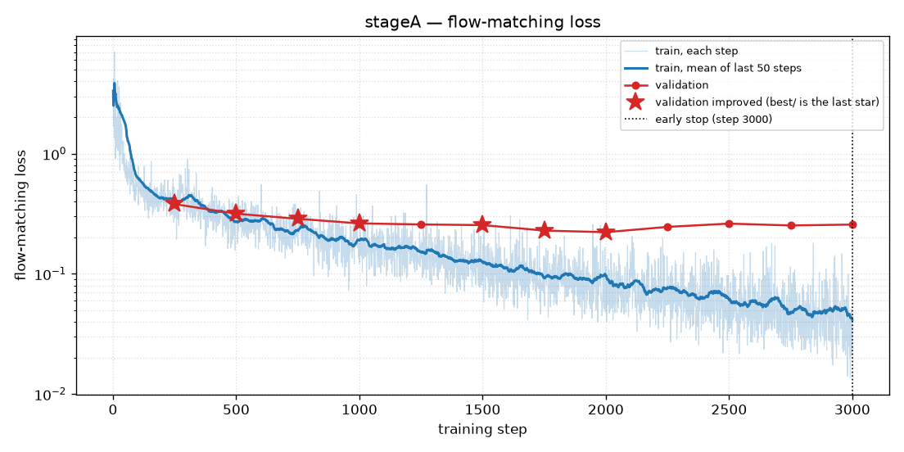
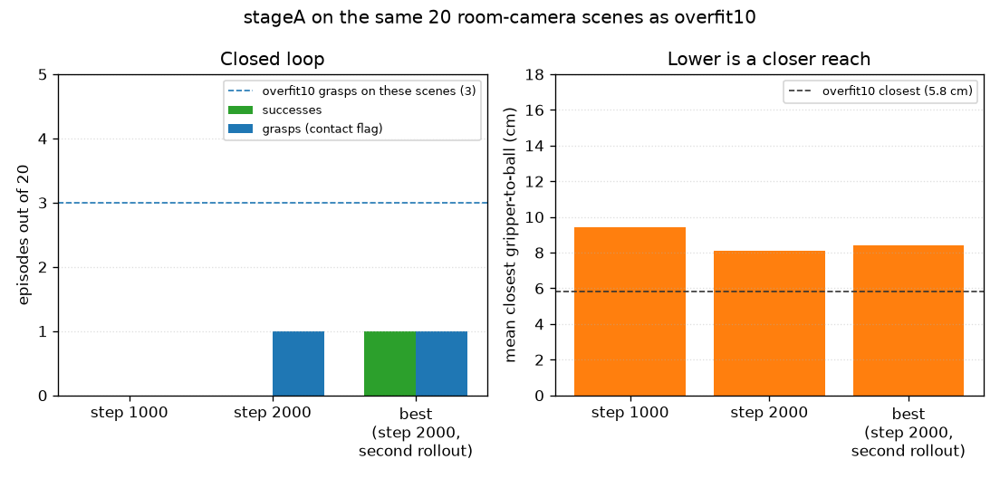

# stageA

Fifty expert throws, same frozen-vision recipe as overfit10, room camera. The hope was that more demonstrations would grasp more often and reach closer than the 10-demo run. On the same 20 scenes, it did the opposite.

## Recipe

Started from `lerobot/smolvla_base`. Train set `data/datasets/train50` (50 episodes). Validation `data/datasets/val30`, with the closed-loop test using 20 of those scenes (`eval20_seeds.json`), the same 20 used for the overfit10 baseline. Vision and language stayed frozen. Batch 8, learning rate 1e-4, warmup 300, schedule written for 4000 steps. Checkpoints every 1000 steps. Early stop at step 3000. `best/` is step 2000, the lowest validation loss.

These videos are the room camera. Re-running this checkpoint in the current simulator would feed it the later shoulder camera.

## The loss

Plotted from `checkpoints/stageA/train_log.csv` and `val_log.csv`.

Training loss falls for the whole run and is 0.029 on the last step. Validation loss falls until step 2000 (0.222) and then rises: 0.246, 0.262, 0.253, 0.257. Stars are the checks that improved by the early-stop rule. The last star is step 2000, and that is `best/`. The dotted line is the stop at step 3000, four checks with no improvement above 2%.

After step 2000 the training curve is still going down while validation is going up. The action head is memorizing the 50 demonstrations.

## The robot

Same 20 room-camera scenes as the overfit10 baseline (3 grasps, 5.8 cm, nothing in the bin).

| Checkpoint | In the bin | Grasps | Closest |
|---|---|---|---|
| step 1000 | 0/20 | 0 | 9.4 cm |
| step 2000 | 0/20 | 1 | 8.1 cm |
| `best/` (step 2000, rolled out again) | 1/20 | 1 | 8.4 cm |

The dashed lines on the chart are the overfit10 result on these scenes. Stage A is farther from the ball at every checkpoint, and it grasps less often.

The one ball that ended in the bin is a different episode from the one grasp. On the "success" (blue ball, orange bin) the contact flag never turned on, and the control point's closest approach was 6.4 cm. The bin check does not require a grasp, so this is "the ball rested in the target bin," and the video is the way to see whether that was a throw. The actual grasp was purple into blue, 0.7 cm, and the ball missed the bin.

`step_002000` and `best/` are the same weights. One rollout grasped and missed. The other put one ball in the bin and grasped a different episode. That is sampling noise. A 20-episode eval cannot rank checkpoints more finely than about one grasp.

Open-loop, on frozen demo frames rather than a live rollout (`artifacts/diag_offline_gen.json`, this `best/` checkpoint): the commanded hand sits 3.3 cm from the expert on training frames and 4.4 cm on validation frames, about 5 cm at the first frame. Inside a predicted chunk the command moves about 2 cm per step. The expert moves about 0.6 cm per step. The loss can look settled while the hand path is still a few centimeters off and much jerkier than the demonstration. The grasp lives in that leftover centimeter.

## Videos

- `videos/step1000_never_grasped_blue-into-orange.mp4` — step 1000. The hand never makes contact. This is 19 of the 20 episodes at this checkpoint.
- `videos/step2000_grasped_then_missed_purple-into-blue.mp4` — step 2000. The one grasp. The ball misses the bin.
- `videos/best_ball_in_bin_blue-into-orange.mp4` — the second rollout of the step-2000 weights. The ball ends in the orange bin. The contact flag on this episode stayed false.

## Why this happened

Fifty demonstrations of the same frozen image features gave the action head more reaches to average over. Validation loss improved, then the model overfit, and the live arm got worse at the ball than the 10-demo checkpoint (5.8 cm and 3 grasps, versus 8.4 cm and 1 grasp).

If those frozen features do not say where the named ball is, extra demos pull the arm toward a generic version of the training reach. The text-swap and vision probes later measured that directly: the sentence does not select the color, and a readout on the frozen tokens cannot find the ball. Stage A is what that looks like in the loss curve. Training loss keeps falling. The centimeter at the ball does not.

Sources: `checkpoints/stageA/val_log.csv`, `checkpoints/stageA/early_stop.txt`, `artifacts/stageA/*/eval_summary.json`.
